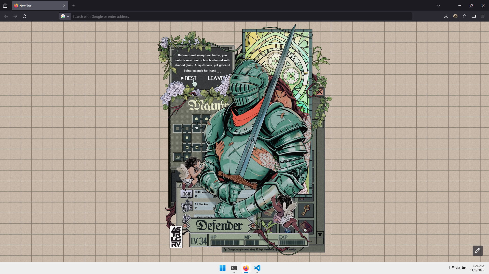
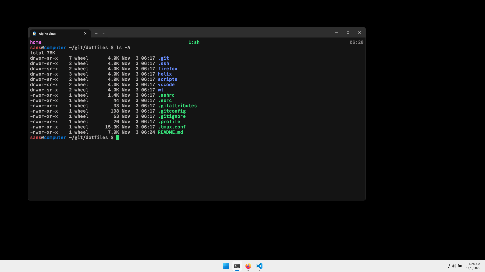
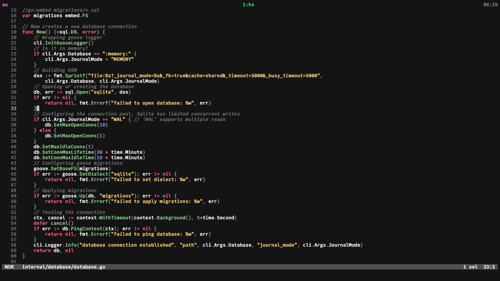

# dotfiles
> I use Alpine Linux on WSL with the latest Windows IoT LTSC

This is what I am working on right now and it's great!  

## Philosophy
* My toolset must be a small selection of quality tools, each serving a distinct purpose,  
  so I can master all of them over time.
* Limiting that building fatigue while working and lowering overhead is a priority and dictates  
  the selection of these tools.
* I will use what works to get to my goals, I won't adopt something just because it's new and shiny
  meaning pragmatism, minimalism and mondernity (when sensible)!
* Keeping things as default as possible to limit time wasted configuring things, but I will  
  update stuff now and then if worth it.
* I must be able to use my most important tools over SSH without any issues.

## My awesome toolset
* rootfs: alpine
  * kernel: linux
  * init: openrc
  * package manager: apk
  * coreutils: busybox
  * libc: musl
* fetch: afetch
* archiver: atool
* request: curl and jq
* encryption: openssl
* editor: helix
* multiplexer: tmux and tmate
* fuzzy finder: skim
* langs:
  * ash(shell scripting)
  * awk(text processing)
  * c(systems programming, llvm/clang toolchain with lldb and make)
  * go(cloud work)
  * python(object oriented, runtime)
  * scheme(functional, chez)
  * sqlite(databases)
  * typst(typesetting)
* vcs: git
* hacking: strace, ltrace and rizin
* remote: openssh, rsync and rclone
* mobile: adb, fastboot and scrcpy
* containers: docker and kubernetes
* infrastructure: aws, azure, tencent, terraform and polumi

Use [manned.org](https://manned.org/) to access manual pages.

## Installation
### Windows IoT LTSC
1. Get the ISO, boot it up and get it done.

> [!TIP]
> Disconnect from the internet, press SHIFT+F10 and write OOBE\BYPASSNRO.  
> Then continue with the installation as usual.  
> This skips the required and enforced login to a Microsoft account(also allowing an offline installation).  
> The way you do this might be changing in the future apparently.

2. Start Windows Updates
3. Install drivers
4. Run the [debloter](https://github.com/Raphire/Win11Debloat/)
5. Go over Windows Settings
6. Enable optional features (Virtual Machine Platform and Windows Subsystem for Linux)
7. Install Firefox (use Mozilla Sync, go over settings, add uBlock Origin [filters](firefox/ublock.txt) and [configure](firefox/unhook.png) YouTube Unhook
8. Get rid of Edge

> [!TIP]
> My bookmarks collection are super curated, so check it out!

8. Install Windows Terminal (apply [settings.json](wt/settings.json))

> [!TIP]
Can be installed with:
```powershell
Add-AppxPackage Microsoft.WindowsTerminal.msixbundle
```

9. Install the [Commit Mono](https://commitmono.com/) font. Other good choices are [JetBrains Mono](https://www.jetbrains.com/lp/mono/) and [Mononoki](https://madmalik.github.io/mononoki/)

10. Install VSCode (apply [settings.json](vscode/settings.json) and [keybindings.json](vscode/keybindings.json))

> [!NOTE]
> I use Windows Terminal and Firefox 90% of the time.
> My VSCode config is awesome and you should give it a try.
> Get the GitHub Theme and Vim extensions from the marketplace.

10. Install qBittorrent, Nomacs, Snipping Tool, VLC, OBS, Figma and whatever else you need.

#### Alpine Linux
1. Download the [latest minimal rootfs](https://www.alpinelinux.org/downloads)
2. Install it
```powershell
wsl.exe --import "Alpine" $env:USERPROFILE\Alpine alpine-minirootfs-x86_64.tar
wsl.exe -d "Alpine Linux"
```

> [!TIP]
> Use `-u` to specify a user as in `wsl.exe -d AlpineWSL -u root`.

3. Upgrade to [edge repositories](https://wiki.alpinelinux.org/wiki/Include:Upgrading_to_Edge)
```sh
apk add alpine-conf openssl busybox-suid busybox-openrc busybox-extras busybox-extras-openrc
# Amsterdam
echo "https://eu.edge.kernel.org/alpine/edge/main" > /etc/apk/repositories
echo "https://eu.edge.kernel.org/alpine/edge/community" >> /etc/apk/repositories
# Japan
echo "https://ap.edge.kernel.org/alpine/edge/main" >> /etc/apk/repositories
echo "https://ap.edge.kernel.org/alpine/edge/community" >> /etc/apk/repositories
# CDN
echo "https://dl-cdn.alpinelinux.org/alpine/edge/main" >> /etc/apk/repositories
echo "https://dl-cdn.alpinelinux.org/alpine/edge/community" >> /etc/apk/repositories
echo "https://dl-cdn.alpinelinux.org/alpine/edge/testing" >> /etc/apk/repositories
```
```sh
# Update
apk update
# Upgrade
apk upgrade -aU
```

> [!WARNING]
> To upgrade to edge you need to use the merge script for now!

4. Add a standard user
```sh
adduser sans -G wheel ; passwd sans
```

5. Doas
```sh
passwd
apk add doas doasedit doas-sudo-shim
echo 'permit persist keepenv :wheel' > /etc/doas.conf
```

7. Networking
```sh
# Required by /etc/init.d/networking that's needed for Docker
touch /etc/network/interfaces
```

6. Content of /etc/wsl.conf
```toml
[automount]
enabled = true

[network]
hostname = "computer"

[interop]
enabled = true
appendWindowsPath = false

[user]
default = "sans"

[boot]
command = "/sbin/openrc default"
```

> [!WARNING]
> Want access to $env:PATH? You need to modify `/etc/profile` and `wsl.conf`.  
> Make $PATH reassign itself as in `export PATH="$PATH:..."` and set `appendWindowsPath` to `true`!

9. Set the timezone and reboot
```sh
apk add tzdata
ln -s /usr/share/zoneinfo/Europe/Rome /etc/localtime
````

10. Reboot
```powershell
wsl.exe --terminate Alpine
wsl.exe -d Alpine
```

> [!TIP]
Use `wsl.exe --shutdown` to shutdown WSL completely affecting all installations.

11. Get the toolset
```sh
doas apk add --no-interactive afetch atool curl file skim jq \
  openssh-client openssh-keygen rsync rclone \
  git git-lfs helix helix-tree-sitter-vendor tmux tmate \
  strace ltrace rizin
```
```sh
# C on LLVM/Clang with LLDB and GNU Make
doas apk add llvm lldb clang clang-extra-tools make
```
```sh
# Go with Delve
doas apk add go delve gopls
go install golang.org/x/pkgsite/cmd/pkgsite@latest
go install golang.org/x/tools/cmd/goimports@latest
go install golang.org/x/vuln/cmd/govulncheck@latest
```
```sh
# Python with Pip
doas apk add python3 py3-pip
doas apk add ty ruff
```
```sh
# Scheme
doas apk add chez-scheme
```
```sh
# Sqlite
doas apk add sqlite
```
```sh
# Typst
doas apk add typst tinymist
```
```sh
# Docker
doas apk add docker
doas rc-update add containerd default
doas rc-update add docker default
doas adduser sans docker
```

8. Dotfiles
```sh
git clone https://github.com/sansneo/dotfiles
cd dotfiles
mkdir ~/.config 2>/dev/null
cp .ashrc ~/
cp .profile ~/
cp .exrc ~/
cp .tmux.conf ~/
cp .gitconfig ~/
cp -r .ssh/ ~/
cp -r helix/ ~/.config
cp -r scripts/ ~/.config
```

9. Remove default Helix themes
```sh
doas rm -rf /usr/share/helix/runtime/themes
```

10. Done! 🎉

## Screenshots




## Conclusion
This is made by myself for myself.  
Clone disks or use images instead of reinstalling if you can as this takes like an hour to do.  
Remember to sync stuff with Google Drive or something self hosted like Syncthing or Restic as in the future!

I might install this on a server rather then WSL!

> [!WARNING]
> I do not use AI for anything related to programming and will fucking refuse to.  
> Say "thank you daddy George Hotz".
